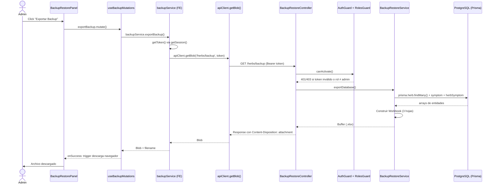
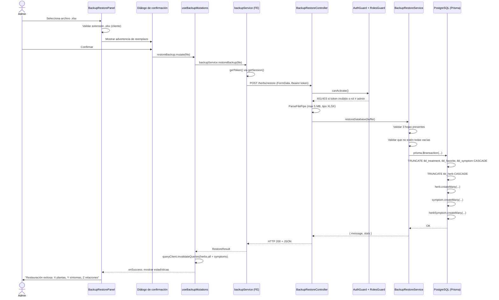

# Design Document — herbs-backup-restore

## Overview

La funcionalidad de Backup/Restore permite a los administradores de **Living Roots** exportar la base de datos de plantas medicinales a un archivo Excel (`.xlsx`) y restaurarla desde ese mismo archivo. El sistema cubre dos operaciones complementarias que son simétricas: la exportación genera el archivo desde la BD, y la restauración invierte el proceso reemplazando el contenido de la BD con los datos del archivo, todo dentro de una transacción ACID.

**Alcance del trabajo:**
- Backend: agregar `exportDatabase()` al servicio existente, nuevo endpoint `GET /herbs/backup`, proteger ambos endpoints con guards JWT/Roles, actualizar el módulo.
- Frontend: método `getBlob()` en `apiClient`, nuevo `backup-service.ts`, hook `useBackupMutations`, componente `BackupRestorePanel`, integración en `PlantManagement`.
- Tests: suite Jest para servicio (unitarias + round-trip) y controlador (guards).

---

## Arquitectura

### Flujo de Exportación (Backup)



### Flujo de Restauración (Restore)



---

## Componentes e Interfaces

### Backend

#### `BackupRestoreController` (modificado)

Agrega `GET /herbs/backup` y protege ambos endpoints con guards. Los guards se aplican a nivel de clase tal como hace `HerbsController`.

```typescript
@Controller('herbs')
@UseGuards(AuthGuard, RolesGuard)
@Roles(Role.Admin)
export class BackupRestoreController {
  // GET /herbs/backup  ← nuevo
  // POST /herbs/restore ← existente, ahora protegido
}
```

**Decisión de diseño:** aplicar los decoradores `@UseGuards` y `@Roles` a nivel de clase (no de método) sigue el patrón del proyecto y garantiza que cualquier endpoint futuro en este controlador quede protegido por defecto.

#### `BackupRestoreService.exportDatabase()` (nuevo método)

```typescript
async exportDatabase(): Promise<Buffer>
```

1. Consulta las tres entidades en paralelo con `Promise.all`.
2. Mapea cada entidad al formato de columnas del Excel, reemplazando `null` por los literales (`N/A`, `Sin descripción`).
3. Construye el workbook con `xlsx.utils.json_to_sheet` y `xlsx.utils.book_append_sheet`.
4. Retorna el buffer con `xlsx.write(workbook, { type: 'buffer', bookType: 'xlsx' })`.
5. Si los tres arrays están vacíos, lanza `BadRequestException("No hay datos para exportar. La base de datos está vacía.")`.

#### `HerbsBackupRestoreModule` (modificado)

`JwtModule` está registrado con `global: true` en `AuthModule`, por lo que el módulo ya tiene acceso a `JwtService`. Sin embargo, `AuthGuard` y `RolesGuard` necesitan estar disponibles como providers locales (o globales). La solución es agregarlos al array `providers`:

```typescript
@Module({
  controllers: [BackupRestoreController],
  providers: [
    BackupRestoreService,
    PrismaService,
    AuthGuard,
    RolesGuard,
    Reflector,   // requerido por RolesGuard
  ],
})
export class HerbsBackupRestoreModule {}
```

**Nota:** `JwtService` no necesita importarse explícitamente porque `JwtModule` es global.

### Frontend

#### `apiClient.getBlob()` (modificado `lib/api-client.ts`)

Función `apiRequestBlob` que usa `response.blob()` en lugar de `response.json()`. Maneja errores de la misma manera que `apiRequest`: lee el cuerpo como JSON para el mensaje de error si la respuesta no es `ok`.

```typescript
async function apiRequestBlob(
  endpoint: string,
  token?: string,
): Promise<Blob> {
  const response = await fetch(`${BASE_URL}${endpoint}`, {
    method: 'GET',
    headers: {
      ...(token && { Authorization: `Bearer ${token}` }),
    },
  })
  if (!response.ok) {
    const error = await response
      .json()
      .catch(() => ({ message: 'Error desconocido' }))
    throw new Error(error.message || 'Error en la petición')
  }
  return response.blob()
}

// Se expone en apiClient como:
getBlob: (url: string, token?: string) => apiRequestBlob(url, token)
```

#### `services/backup-service.ts` (nuevo)

```typescript
export const backupService = {
  async exportBackup(): Promise<{ blob: Blob; filename: string }>,
  async restoreBackup(file: File): Promise<RestoreResult>,
}
```

- `exportBackup`: llama `apiClient.getBlob('/herbs/backup', token)`. Genera el nombre `living-roots-backup-YYYY-MM-DD.xlsx` usando `new Date()` en el momento de la llamada.
- `restoreBackup`: crea `FormData`, añade el archivo con key `backup`, llama `apiClient.post('/herbs/restore', formData, token)`.

**Nota:** Para enviar `FormData`, el `apiRequest` del `apiClient` no debe añadir `Content-Type: application/json`; `FormData` con `multipart/form-data` lo gestiona el browser automáticamente. Se necesita omitir el header `Content-Type` al enviar `FormData`. El método `post` del `apiClient` acepta `body: unknown`; cuando el body es `FormData`, no se serializa con `JSON.stringify` y no se pone `Content-Type`. Se implementará un método dedicado `postForm` en `apiClient` para este caso.

#### `hooks/mutations/useBackupMutations.ts` (nuevo)

```typescript
export function useBackupMutations() {
  const exportBackup: UseMutationResult  // llama backupService.exportBackup()
  const restoreBackup: UseMutationResult // llama backupService.restoreBackup(file)
  // onSuccess de restoreBackup: invalida herbs.all y symptoms (queryKey: ['symptoms'])
}
```

#### `components/herbs/BackupRestorePanel.tsx` (nuevo)

Sección con dos partes:
1. **Exportar:** botón "Exportar Backup" que dispara `exportBackup.mutate()`.
2. **Restaurar:** input de archivo (acepta `.xlsx`), validación client-side, diálogo de confirmación (`AlertDialog` de shadcn/ui), progreso, estadísticas de resultado.

#### Integración en `PlantManagement.tsx`

Se añade `<BackupRestorePanel />` al final del JSX, dentro del `<div className='space-y-6'>`.

---

## Modelos de Datos

### Tipos TypeScript nuevos

```typescript
// services/backup-service.ts y hooks/mutations/useBackupMutations.ts

/** Resultado de la operación de restauración retornado por el backend */
export interface RestoreResult {
  message: string
  stats: {
    plantas_restauradas: number
    sintomas_restaurados: number
    relaciones_restauradas: number
  }
}

/** Resultado interno de exportBackup para el hook */
export interface ExportBackupResult {
  blob: Blob
  filename: string  // formato: living-roots-backup-YYYY-MM-DD.xlsx
}
```

### Mapeo de columnas Excel ↔ Prisma

| Hoja Excel | Columna Excel | Campo Prisma | Null → |
|---|---|---|---|
| Plantas Medicinales | `ID Planta` | `herb_id` | — |
| Plantas Medicinales | `Nombre` | `name` | — |
| Plantas Medicinales | `Descripción` | `description` | — |
| Plantas Medicinales | `URL Imagen` | `img` | — |
| Plantas Medicinales | `Cultivador` | `cultivator` | `"N/A"` |
| Plantas Medicinales | `Info Importante` | `important` | `"N/A"` |
| Síntomas | `ID Síntoma` | `symptom_id` | — |
| Síntomas | `Nombre Síntoma` | `name` | — |
| Síntomas | `Descripción Síntoma` | `description` | `"Sin descripción"` |
| Tratamientos (Relación) | `ID Planta` | `herbId` | — |
| Tratamientos (Relación) | `ID Síntoma` | `symptomId` | — |
| Tratamientos (Relación) | `Partes Utilizadas` | `partsplant` | — |
| Tratamientos (Relación) | `Preparación` | `prepare` | — |
| Tratamientos (Relación) | `Aplicación` | `apply` | `"N/A"` |

### Orden de truncate en restore (respeta FK)

```sql
TRUNCATE TABLE "tbl_treatment", "tbl_favorite", "tbl_symptom" CASCADE;
TRUNCATE TABLE "tbl_herb" CASCADE;
```

### Orden de inserción en restore (respeta FK)

1. `herb.createMany()` — tabla padre
2. `symptom.createMany()` — tabla independiente
3. `herbSymptom.createMany()` — tabla de relación (depende de herb y symptom)

---

## Propiedades de Corrección

*Una propiedad es una característica o comportamiento que debe ser verdadera en todas las ejecuciones válidas del sistema — esencialmente, un enunciado formal sobre lo que el sistema debe hacer. Las propiedades sirven como puente entre especificaciones legibles por humanos y garantías de corrección verificables automáticamente.*

### Propiedad 1: Estructura del Workbook exportado

*Para cualquier* estado de base de datos no vacío (cualquier combinación de plantas, síntomas y tratamientos), el `Workbook` generado por `exportDatabase()` debe contener exactamente tres hojas con los nombres `"Plantas Medicinales"`, `"Síntomas"` y `"Tratamientos (Relación)"`.

**Valida: Requisitos 1.2**

---

### Propiedad 2: Columnas correctas en cada hoja

*Para cualquier* conjunto de datos generado, la primera fila (encabezados) de cada hoja del workbook debe contener exactamente las columnas especificadas:
- `Plantas Medicinales`: `ID Planta`, `Nombre`, `Descripción`, `URL Imagen`, `Cultivador`, `Info Importante`
- `Síntomas`: `ID Síntoma`, `Nombre Síntoma`, `Descripción Síntoma`
- `Tratamientos (Relación)`: `ID Planta`, `ID Síntoma`, `Partes Utilizadas`, `Preparación`, `Aplicación`

**Valida: Requisitos 1.3, 1.4, 1.5**

---

### Propiedad 3: Campos opcionales nulos se codifican como literales

*Para cualquier* planta con `cultivator = null` o `important = null`, síntoma con `description = null`, o tratamiento con `apply = null`, el valor exportado al Excel debe ser el literal correspondiente (`"N/A"` o `"Sin descripción"`), no una celda vacía ni `undefined`.

**Valida: Requisitos 1.6, 1.7, 1.8**

---

### Propiedad 4: Round-trip backup → restore equivale al estado original

*Para cualquier* estado no vacío de la base de datos (cualquier número de plantas, síntomas y tratamientos), ejecutar `exportDatabase()` para obtener un buffer `.xlsx` y luego `restoreDatabase(buffer)` debe resultar en un conjunto de datos equivalente al estado original — los mismos IDs, nombres, descripciones, y relaciones.

Esta propiedad garantiza la simetría entre exportación e importación: los valores nulos se codifican como literales en el Excel y se decodifican de vuelta a `null` al restaurar.

**Valida: Requisitos 2.12, 6.3**

---

### Propiedad 5: Formato del nombre de archivo de backup

*Para cualquier* fecha válida, el nombre de archivo generado por el frontend debe seguir el patrón `living-roots-backup-YYYY-MM-DD.xlsx`, donde `YYYY`, `MM` y `DD` corresponden al año, mes y día de esa fecha, con ceros a la izquierda cuando corresponda.

**Valida: Requisitos 3.3**

---

## Manejo de Errores

### Mapa de errores Backend → Frontend

| Situación | Código HTTP | Mensaje backend | Mensaje mostrado al usuario |
|---|---|---|---|
| BD vacía al exportar | 400 | `"No hay datos para exportar. La base de datos está vacía."` | Mostrar tal cual |
| Archivo sin las 3 hojas | 400 | `"Estructura de backup inválida..."` | Mostrar tal cual |
| Las 3 hojas están vacías | 400 | `"El archivo de backup está vacío."` | Mostrar tal cual |
| Error durante transacción | 500 | `"Fallo en la restauración... Motivo: ..."` | Mostrar tal cual |
| Archivo > 5 MB | 400 | (NestJS pipes) | `"El archivo excede el límite de 5 MB."` |
| Tipo de archivo incorrecto | 400 | (NestJS pipes) | `"Solo se aceptan archivos .xlsx."` |
| Token inválido o ausente | 401 | `"Token no proporcionado"` / `"Unauthorized"` | `"Sesión expirada. Por favor inicia sesión nuevamente."` |
| Rol sin permisos | 403 | `"Forbidden"` | `"No tienes permisos para esta acción."` |
| Error de red / sin conexión | — | — | `"Error de conexión. Verifica tu red e intenta de nuevo."` |

### Validaciones client-side en `BackupRestorePanel`

1. **Extensión del archivo**: antes de mostrar el diálogo, verificar que `file.name.endsWith('.xlsx')`. Si no, mostrar error sin llamar al backend.
2. **Archivo seleccionado**: el botón "Restaurar" permanece deshabilitado hasta que se seleccione un archivo válido.
3. **Diálogo de confirmación**: advertencia explícita antes de enviar al backend para evitar restauraciones accidentales.

### Estrategia de rollback

La transacción de Prisma garantiza rollback automático en caso de fallo. Si `restoreDatabase` lanza `InternalServerErrorException`, la BD permanece en el estado previo al intento de restauración (gracias a `prisma.$transaction`). El frontend muestra el mensaje de error sin invalidar el caché de React Query, preservando la vista actual.

---

## Estrategia de Pruebas

### Librerías

- **Backend:** Jest (ya configurado en el proyecto NestJS), `@nestjs/testing`, `fast-check` para property-based testing.
- **Frontend:** Sin suite de pruebas explícita requerida en los requirements. Las propiedades del frontend (Propiedad 5) pueden validarse con una función pura simple en Jest si se añade.

### `herbs-backup-restore.service.spec.ts`

**Pruebas unitarias (example-based):**

1. `exportDatabase()` — estructura del workbook:
   - Mock de `prisma.herb.findMany`, `prisma.symptom.findMany`, `prisma.herbSymptom.findMany` con datos de prueba fijos.
   - Verificar: buffer es instancia de `Buffer`, workbook contiene 3 hojas con nombres correctos, encabezados de cada hoja correctos.

2. `exportDatabase()` — BD vacía lanza error:
   - Mock de los tres findMany retornando `[]`.
   - Verificar: lanza `BadRequestException` con mensaje `"No hay datos para exportar..."`.

3. `exportDatabase()` — codificación de nulls:
   - Planta con `cultivator: null`, `important: null`; síntoma con `description: null`; tratamiento con `apply: null`.
   - Verificar: celdas contienen `"N/A"` / `"Sin descripción"`.

4. `restoreDatabase()` — flujo exitoso:
   - Mock de `prisma.$transaction` que ejecuta el callback.
   - Mock de `$executeRaw`, `herb.createMany`, `symptom.createMany`, `herbSymptom.createMany`.
   - Verificar: retorna `{ message, stats }` con conteos correctos.

5. `restoreDatabase()` — hojas faltantes:
   - Generar workbook sin la hoja `"Síntomas"`.
   - Verificar: lanza `BadRequestException` con mensaje descriptivo.

6. `restoreDatabase()` — las 3 hojas vacías:
   - Generar workbook con las 3 hojas pero sin filas de datos.
   - Verificar: lanza `BadRequestException("El archivo de backup está vacío.")`.

7. `restoreDatabase()` — error en transacción:
   - Mock de `prisma.$transaction` que lanza `Error("DB error")`.
   - Verificar: lanza `InternalServerErrorException` con el motivo.

**Prueba de propiedad (Propiedad 4 — round-trip):**

```typescript
// Tag: Feature: herbs-backup-restore, Property 4: backup→restore round-trip
// Configurado con fast-check, mínimo 100 iteraciones
it('round-trip: exportDatabase → restoreDatabase preserva datos equivalentes', async () => {
  await fc.assert(
    fc.asyncProperty(
      fc.array(herbArbitrary, { minLength: 1, maxLength: 20 }),
      fc.array(symptomArbitrary, { minLength: 0, maxLength: 10 }),
      fc.array(treatmentArbitrary, { minLength: 0, maxLength: 30 }),
      async (herbs, symptoms, treatments) => {
        // 1. Mock Prisma para exportDatabase
        // 2. Llamar exportDatabase() → buffer
        // 3. Llamar restoreDatabase(buffer) con mock de $transaction
        // 4. Capturar args de herb.createMany, symptom.createMany, herbSymptom.createMany
        // 5. Verificar que los datos restaurados son equivalentes a los originales
        //    (mismos IDs, nombres, valores nulos restaurados correctamente)
      }
    ),
    { numRuns: 100 }
  )
})
```

Los `arbitrary` generan objetos con campos opcionales `null` con probabilidad ~30% para cubrir la codificación de literales.

### `herbs-backup-restore.controller.spec.ts`

**Pruebas de guards (example-based):**

1. `GET /herbs/backup` sin token → 401:
   - Crear mock de `BackupRestoreService`.
   - Sobreescribir `AuthGuard.canActivate` para simular `UnauthorizedException`.
   - Verificar: respuesta HTTP 401, `exportDatabase` nunca se llama.

2. `POST /herbs/restore` sin token → 401:
   - Mismo patrón que el anterior.

3. `GET /herbs/backup` con rol no-admin → 403:
   - Mock `AuthGuard` exitoso, `RolesGuard` lanza `ForbiddenException`.
   - Verificar: respuesta HTTP 403.

4. `POST /herbs/restore` con rol no-admin → 403:
   - Mismo patrón que el anterior.

5. `GET /herbs/backup` exitoso con admin → 200 + Content-Disposition:
   - Ambos guards permiten la solicitud.
   - Mock de `exportDatabase()` retorna un `Buffer` con workbook mínimo válido.
   - Verificar: status 200, header `Content-Disposition` contiene `attachment` y `.xlsx`.

### Configuración de property tests

```typescript
// Minimum 100 iterations per property test
// Tag format: Feature: herbs-backup-restore, Property N: <property text>
fc.configureGlobal({ numRuns: 100 })
```

---

## Secuencia de Archivos a Crear/Modificar

### Backend (NestJS)

| # | Acción | Archivo | Descripción |
|---|---|---|---|
| 1 | Modificar | `src/herbs-backup-restore/herbs-backup-restore.service.ts` | Añadir método `exportDatabase()` |
| 2 | Modificar | `src/herbs-backup-restore/herbs-backup-restore.controller.ts` | Añadir `GET /herbs/backup`, `@UseGuards`, `@Roles` a nivel de clase |
| 3 | Modificar | `src/herbs-backup-restore/herbs-backup-restore.module.ts` | Añadir `AuthGuard`, `RolesGuard`, `Reflector` a providers |
| 4 | Crear | `src/herbs-backup-restore/herbs-backup-restore.service.spec.ts` | Suite Jest: unitarias + property test round-trip |
| 5 | Crear | `src/herbs-backup-restore/herbs-backup-restore.controller.spec.ts` | Suite Jest: pruebas de guards 401/403 |

### Frontend (Next.js)

| # | Acción | Archivo | Descripción |
|---|---|---|---|
| 6 | Modificar | `lib/api-client.ts` | Añadir `apiRequestBlob()` y `apiClient.getBlob()` + `apiClient.postForm()` |
| 7 | Crear | `services/backup-service.ts` | `exportBackup()` y `restoreBackup(file)` |
| 8 | Crear | `hooks/mutations/useBackupMutations.ts` | Mutations para export e import con invalidación de caché |
| 9 | Crear | `components/herbs/BackupRestorePanel.tsx` | Panel UI con botón export + área de restore + diálogo |
| 10 | Modificar | `components/herbs/PlantManagement.tsx` | Añadir `<BackupRestorePanel />` al final del JSX |

---

## Decisiones de Diseño Destacadas

1. **Guards a nivel de clase:** Sigue el patrón de `HerbsController`. Más seguro y menos propenso a errores de omisión que aplicarlos por método.

2. **`JwtModule` global:** Como está registrado con `global: true` en `AuthModule`, `HerbsBackupRestoreModule` no necesita importarlo; solo necesita añadir `AuthGuard`, `RolesGuard` y `Reflector` como providers locales.

3. **`apiClient.postForm()`:** El método `post` existente serializa el body con `JSON.stringify` y fuerza `Content-Type: application/json`, lo que rompe `multipart/form-data`. Se añade un método separado `postForm` que no toca el body ni los headers de contenido, dejando que el browser establezca el boundary de forma automática.

4. **Nombre de archivo con fecha del cliente:** La fecha del backup se genera en el frontend al momento de la descarga, no en el backend. Esto mantiene el backend sin estado respecto a la zona horaria del cliente y evita parsear headers de respuesta.

5. **Invalidación de caché tras restore:** Se invalida `QUERY_KEYS.herbs.all` y el prefijo `['symptoms']` (todas las queries de síntomas) para garantizar que la tabla de plantas y cualquier búsqueda por síntomas refleje los datos restaurados inmediatamente.

6. **`fast-check` para la propiedad de round-trip:** Usar una librería de PBT establecida en lugar de implementar la generación de datos desde cero. La librería genera automáticamente casos edge (strings vacíos, UUIDs con caracteres especiales, arrays de longitud 0) que serían difíciles de anticipar manualmente.
